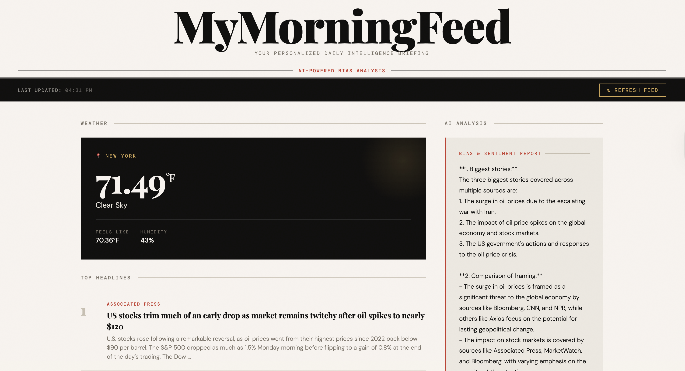

# MyMorningFeed 🌅

A fully automated data pipeline that delivers a personalized morning briefing — live weather, top headlines from multiple news sources, and AI-powered media bias analysis through a clean web dashboard built with Python and Flask.

---

## What It Does

Every morning, MyMorningFeed:

1. **Fetches live weather** for your city via the OpenWeatherMap API
2. **Pulls top headlines** from multiple news sources via NewsAPI
3. **Runs AI bias analysis** using Groq's LLaMA model to compare how different outlets frame the same stories
4. **Stores everything** in a local SQLite database for historical tracking
5. **Serves it all** through a responsive web dashboard

---

## Demo



---

## Project Structure

```
MyMorningFeed/
│
├── app.py              # Flask web server and route handling
├── weather.py          # OpenWeatherMap API integration
├── news.py             # NewsAPI integration
├── bias_analysis.py    # Groq AI bias and sentiment analysis
├── database.py         # SQLite database setup and queries
│
├── templates/
│   └── index.html      # Web dashboard frontend
│
├── .env                # API keys (not committed)
├── .gitignore
└── requirements.txt
```

---

## Features

- **Live Weather** — real-time temperature, feels like, humidity, and conditions for any city
- **Multi-Source Headlines** — pulls from CNN, Fox News, BBC, AP, Washington Post, and more
- **AI Bias Analysis** — LLaMA 3.3 identifies top stories, compares source framing, and rates sentiment (Positive / Negative / Neutral) per outlet
- **Persistent Storage** — every pipeline run saves weather, articles, and analysis to SQLite
- **One-Click Refresh** — refresh button re-runs the full pipeline and updates the dashboard
- **Responsive Design** — works on desktop and mobile

---

## How the AI Analysis Works

All headlines and descriptions are sent to Groq's LLaMA 3.3 70B model with a structured prompt that asks it to:

1. Identify the 2-3 biggest stories covered across multiple sources
2. Compare how each outlet framed the same story
3. Note differences in tone, emphasis, and word choice
4. Assign a sentiment rating per source: Positive, Negative, or Neutral

This makes it easy to spot media bias patterns across left and right-leaning outlets covering the same events.
